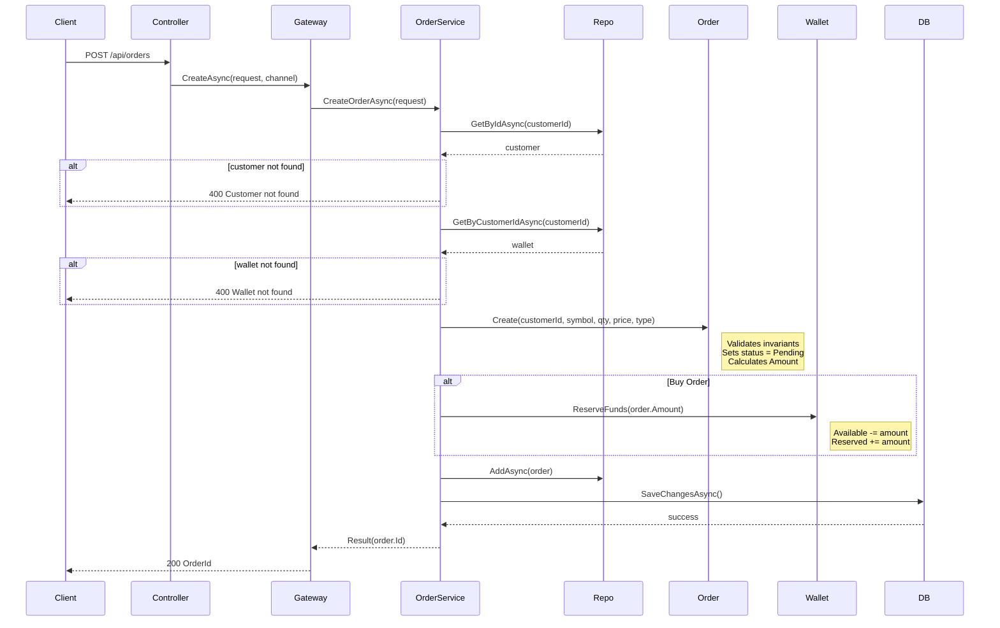
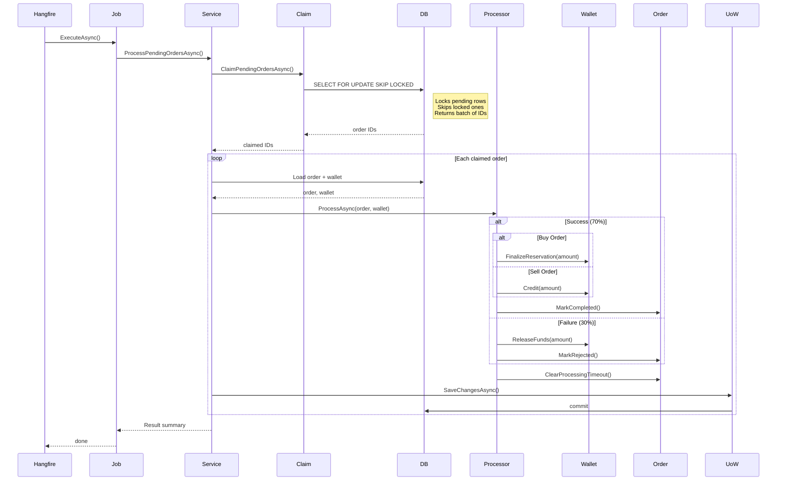

# ArasTrader

A trading order management system that synchronizes customers from an external API, manages wallet balances, accepts buy/sell orders, and processes them asynchronously through a scheduled background worker — built with .NET 10, PostgreSQL, and Clean Architecture.

## Tech Stack

| Layer | Technology |
|-------|-----------|
| Runtime | .NET 10, ASP.NET Core |
| Database | PostgreSQL 17, Entity Framework Core |
| Background Jobs | Hangfire with PostgreSQL storage |
| External API | Refit |
| Resilience | Polly (retry policies) |
| Deployment | Docker Compose |
| Architecture | Clean Architecture (Domain / Application / Infrastructure / API / Worker) |

## Highlights

These are the decisions I'm most confident about:

- **Atomic order claiming** with PostgreSQL `FOR UPDATE SKIP LOCKED` — multiple workers can process orders concurrently without duplication or locking contention
- **Two-layer concurrency strategy** — optimistic concurrency (`xmin` column) for wallet and order updates, pessimistic row locking for background order claiming
- **Three-tier token fallback** — memory cache, PostgreSQL persistence, then automatic refresh/re-auth, protected by `SemaphoreSlim` to prevent thundering herd
- **Gateway pattern** for order entry — currently REST, but designed so adding FIX, gRPC, or message queue channels requires zero changes to business logic
- **Rich domain model** — entities enforce their own invariants, state transitions, and balance constraints. No anemic data bags.

## Quick Start

**Prerequisites:** Docker and Docker Compose.

```bash
# Set credentials for the external API
export ARAS_API_USERNAME=<username>
export ARAS_API_PASSWORD=<password>

# Start everything (PostgreSQL, API, Worker)
docker compose up --build
```

| Service | URL |
|---------|-----|
| Swagger UI | http://localhost:8080/swagger |
| Hangfire Dashboard | http://localhost:8080/hangfire |
| API | http://localhost:8080 |
| PostgreSQL | localhost:5432 |

**Try it:**

1. Open Swagger UI and run `POST /api/customers/sync` to pull customers from the external API
2. Create an order with `POST /api/orders`
3. Watch it get processed in the Hangfire Dashboard

To stop and wipe data: `docker compose down -v`

## Architecture

Five projects, strict unidirectional dependencies:

```
Api / Worker  -->  Infrastructure  -->  Application  -->  Domain
(composition     (EF Core, Refit,     (services,        (entities,
 roots)           Hangfire, repos)     interfaces)       rules)
```

```text
                        +------------------+
                        |  External Aras  |
                        |      API        |
                        +--------+--------+
                                 ^
                            Refit Client
                                 |
                  +--------------+--------------+
                  |                             |
         +--------+--------+          +--------+--------+
         |  ArasTrader.Api |          |  ArasTrader     |
         |  (endpoints,    |          |  Worker          |
         |   Swagger,      |          |  (Hangfire       |
         |   Hangfire UI)  |          |   Server)        |
         +--------+--------+          +--------+--------+
                  |                             |
                  +-----------+  +--------------+
                              |  |
                     +--------v--v--------+
                     |    Application     |
                     |  (services, GWs)   |
                     +--------+-----------+
                              |
                     +--------v-----------+
                     |      Domain        |
                     +--------+-----------+
                              ^
                     +--------+-----------+
                     |   Infrastructure    |
                     | (EF Core, Repos,    |
                     |  TokenManager)      |
                     +--------+-----------+
                              |
                     +--------v-----------+
                     |     PostgreSQL      |
                     +--------------------+
```

**Key wiring:**
- `AddApplication()` registers all service implementations in the Application layer
- `AddInfrastructure(IConfiguration)` registers EF Core, repositories, Refit clients, Hangfire, and token management
- Both the API and Worker share the same database and DI registrations
- Migrations auto-apply on API startup via `dbContext.Database.Migrate()`

## Design Decisions

I want to explain *why* these choices were made, not just *what* was built.

### Why `xmin` concurrency instead of manual version columns

PostgreSQL's `xmin` system column gives us optimistic concurrency for free — no extra column to maintain, no application-level version tracking. EF Core maps it as a concurrency token, so any conflicting update is detected at save time. I chose this over a manual `RowVersion` column because it's native to PostgreSQL and eliminates an entire class of bugs where the application forgets to increment the version.

### Why `FOR UPDATE SKIP LOCKED` for order claiming

The order processing worker needs to claim batches of pending orders atomically. `FOR UPDATE SKIP LOCKED` is the PostgreSQL-native solution: it locks the selected rows while letting other workers skip past them and process different orders. No distributed locks, no message broker, no Redis — just the database doing what it's good at. I considered using Hangfire's built-in job queue, but that would have hidden the order claiming logic and made it harder to implement the timeout-based reclaim mechanism.

### Why a Gateway layer for orders

I introduced `IOrderGateway` between controllers and `IOrderService` because trading systems typically have multiple entry points — REST APIs, FIX adapters, message queue consumers, partner integrations. The gateway isolates channel-specific concerns (logging, request mapping, future authentication) while business rules stay in the service layer. Adding a new channel means implementing `IOrderGateway` without touching `IOrderService`.

### Why token persistence matters

The external API requires authentication for every customer sync. Without persistence, every application restart would trigger a fresh login. I implemented a three-tier fallback: check the in-memory cache first, then the database, then attempt a refresh, and only authenticate from scratch as a last resort. The `SemaphoreSlim` guard prevents 100 concurrent requests from all hitting the login endpoint simultaneously when the cache is cold.

### Why Hangfire over a dedicated message broker

The assignment scope didn't justify introducing RabbitMQ or Kafka. Hangfire with PostgreSQL storage gives us persistent, retry-capable background jobs with a built-in dashboard — and since we already have PostgreSQL, there's no additional infrastructure to operate. The architecture supports swapping in a message broker later without changing the Application or Domain layers.

## Domain Model

Three entities, all enforcing their own invariants:

### Order

State machine with strict transitions:

```text
Pending  -->  InProgress  -->  Completed
                          \-->  Rejected
```

- Orders can only be edited while `Pending`
- Buy orders reserve funds on creation; sell orders credit on completion
- Failed orders release reserved funds back to the wallet
- Stalled `InProgress` orders are automatically reclaimed after a configurable timeout

### Wallet

Two balances track the customer's financial state:

- `AvailableBalance` — funds available for new orders
- `ReservedBalance` — funds locked by pending buy orders

All balance changes go through domain methods (`ReserveFunds`, `ReleaseFunds`, `FinalizeReservation`, `Credit`) that validate invariants before modifying state. Database CHECK constraints enforce non-negative balances as a safety net.

### Customer

Synchronized from the external API. Each customer gets an automatic wallet on first sync. National code is validated for format (10 digits) and uniqueness.

## Order Flows

### Create Order



### Process Orders (Background Worker)



**Key details:**
- `FOR UPDATE SKIP LOCKED` ensures multiple workers never claim the same order
- Stalled `InProgress` orders beyond the configured timeout are automatically reclaimed for retry
- Batch size and processing interval are tunable through `appsettings.json`

## API Reference

Full request/response contracts are available in Swagger at `/swagger`.

| Method | Endpoint | Description |
|--------|----------|-------------|
| `POST` | `/api/customers/sync` | Pull customers from external API and persist locally |
| `PUT` | `/api/wallet` | Deposit funds into a customer's wallet |
| `POST` | `/api/orders` | Create a new order (starts in `Pending`) |
| `PUT` | `/api/orders/{id}` | Edit an existing order (must be `Pending`) |

**Create an order:**

```bash
curl -X POST http://localhost:8080/api/orders \
  -H "Content-Type: application/json" \
  -d '{"CustomerId": 1, "Symbol": "AAPL", "Quantity": 100, "Price": 150.50, "Type": 1}'
```

**Deposit funds:**

```bash
curl -X PUT http://localhost:8080/api/wallet \
  -H "Content-Type: application/json" \
  -d '{"CustomerId": 1, "Amount": 5000.00}'
```

## Configuration

Required settings (provided via environment variables or `appsettings.json`):

| Variable | Description |
|----------|-------------|
| `ARAS_API_USERNAME` | External API credentials |
| `ARAS_API_PASSWORD` | External API credentials |
| `ConnectionStrings__DefaultConnection` | PostgreSQL connection string |

Optional tuning:

| Setting | Default | Description |
|---------|---------|-------------|
| `OrderProcessing:BatchSize` | 100 | Orders claimed per processing cycle |
| `OrderProcessing:ProcessingTimeout` | 1 minute | Time before stalled orders are reclaimed |
| `OrderProcessing:CronExpression` | `* * * * *` | Hangfire schedule (every minute) |

## Project Structure

```
src/
├── ArasTrader.Domain/            Entities, value objects, domain exceptions, Result<T>
├── ArasTrader.Application/       Service interfaces, DTOs, application services
├── ArasTrader.Infrastructure/    EF Core, Refit clients, Hangfire, repositories
├── ArasTrader.Api/               HTTP controllers, middleware, Swagger
├── ArasTrader.Worker/            Hangfire server, background job registration
└── ArasTrader.slnx               Solution file
```

## What I'd Do Next

If I had more time, I'd prioritize:

1. **Idempotency on order creation** — prevent duplicate orders from retried requests
2. **Integration tests** — especially for the concurrency and order claiming paths
3. **Structured error responses** — machine-readable error codes instead of plain messages
4. **Distributed tracing** — OpenTelemetry for cross-service visibility
5. **Redis caching** — for token storage and customer lookups at scale
6. **Event-driven architecture** — publish domain events for order state changes to decouple downstream consumers

## License

This project was developed as a technical assessment.
